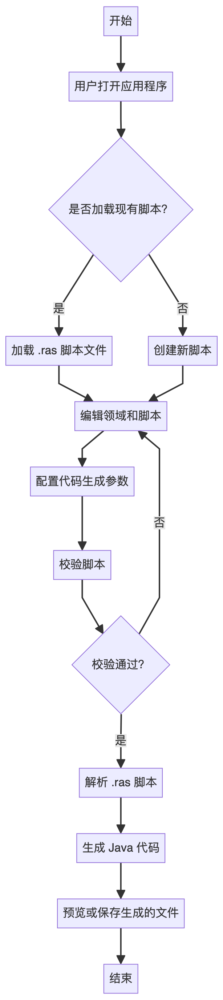

# 🚀 Rest Code

> **一键生成标准化 REST API 代码的可视化桌面工具**

[](https://github.com/dhslegen/rest-code/releases)
[](LICENSE)
[](https://github.com/dhslegen/rest-code/releases)

<p align="center">
  
</p>

## 📋 项目简介

Rest Code 是一个智能的Java代码生成器，专为快速开发REST API而设计。通过简洁的RCS（Rest Code Script）脚本语言，自动生成符合规范的Spring Boot项目代码，包括Controller、Service、VO类等。

## 🎯 主要特性

- 🚀 **快速生成**：通过RCS脚本一键生成完整的REST API代码
- 🎨 **智能校验**：实时语法检查，友好的错误提示
- 🔧 **多版本支持**：同时支持Spring Boot 2.x和3.x
- 📝 **代码预览**：生成前可预览所有代码
- 🎪 **模板丰富**：内置CRUD操作模板
- 🌈 **界面美观**：现代化的用户界面

## 🚀 快速开始

### 1. 下载安装

前往 [Releases](https://github.com/dhslegen/rest-code/releases) 页面下载适合你操作系统的版本：

- **Windows**: `Rest-Code-Setup-x.x.x.exe`
- **macOS**: `Rest-Code-x.x.x.dmg`

### 2. 创建你的第一个 API

```rcs
# 1. 定义领域
/User/用户管理

# 2. 编写 API 脚本
User.POST..create.@.创建用户
User.GET./{id}.get.%id>.获取用户详情
User.PATCH./{id}.update.%id@update.更新用户
User.DELETE./{id}.delete.%id.删除用户
```

### 3. 生成代码

配置输出路径和包名，点击「生成代码」，即可获得完整的 Spring Boot 代码：

### 📋 详细环境搭建指南

🔧 **需要从零开始搭建项目？** 请查看我们的 **[完整环境搭建指南](./SETUP_GUIDE.md)**，包含：

- 🎯 **Spring Boot 2 vs 3 版本对比**
- 🏗️ **Maven/Gradle 完整配置**
- 🛠️ **常见问题解决方案**
- 🚀 **一键项目模板生成**

> 💡 **提示**：Rest Code 内置了项目模板生成功能，可以一键生成包含所有依赖的完整 Spring Boot 项目！

### 4. 生成的代码示例

```java
@RestController
@RequestMapping("/users")
public class UserController {
    
    @PostMapping
    public Result<Void> create(@RequestBody @Valid UserReqVo reqVo) {
        // 业务逻辑
    }
    
    @GetMapping("/{id}")
    public Result<UserRespVo> get(@PathVariable("id") long id) {
        // 业务逻辑
    }
    // ... 更多方法
}

public interface UserService {

    /**
     * 创建用户
     */
    void create(UserReqVo reqVo);

    /**
     * 获取用户详情
     */
    UserRespVo get(long id);
    // ... 更多方法
}

@Service
public class UserServiceImpl implements UserService {

    @Override
    public void create(UserReqVo reqVo) {
        // 业务逻辑
    }

    @Override
    public UserRespVo get(long id) {
        // 业务逻辑
    }
    // ... 更多方法
}

public class UserReqVo implements Serializable {

    /**
     * todo: 待覆盖字段，实际使用时请替换为真实字段，一般实践为从对应的数据库实体类中复制过来
     */
    @Schema(description = "待覆盖字段")
    private String todo;
}
// ... 更多Vo

public interface UserConverter {

    UserConverter INSTANCE = Mappers.getMapper(UserConverter.class);

    /**
     * todo: 待覆盖方法，命名规则是 fromXxxToYyy, 如果包含领域名称，可以忽略领域名称，甚至于from 、to 关键词，因为可以通过上下文推断
     *
     * @param source 待转换数据
     * @return 转换后的数据
     */
    Object fromXxxToYyy(Object source);
}
```
## 🎯 核心功能

### 🔧 智能代码生成
- **Controller** - 标准化的 REST 控制器
- **Service** - 业务逻辑接口与实现
- **VO 类** - 请求响应对象模型
- **Converter** - 实体与 VO 转换器

### 📊 可视化编辑
- **表格编辑器** - 直观的 API 设计界面
- **实时校验** - 即时检测脚本错误
- **双向联动** - 表格与脚本编辑器同步更新
- **代码预览** - 生成前预览代码结构

### 🎨 现代化界面
- **领域管理** - 可视化领域设计
- **一键 CRUD** - 快速生成标准操作
- **批量操作** - 支持列表参数的批量处理
- **模板匹配** - 智能选择代码模板

## 📖 RCS 脚本语言

RCS（Rest Code Script）是专为 API 设计的领域特定语言，语法简洁而强大。

### 基本语法

```
领域名称.HTTP方法.路径.操作名称.参数契约.描述
```

### 参数契约符号

#### `@` - 请求体参数（RequestBody）

| 符号格式 | 参数类型 | 生成代码示例 | 说明 |
|---------|---------|-------------|------|
| `@` | 单个业务对象 | `@RequestBody @Valid UserReqVo reqVo` | 标准请求体对象 |
| `@业务名` | 带业务后缀的对象 | `@RequestBody @Valid UserUpdateReqVo reqVo` | 指定业务场景的请求体 |
| `@=` | 对象列表 | `@RequestBody @Valid List<UserReqVo> reqVos` | 批量操作的对象列表 |
| `@=业务名` | 带业务后缀的对象列表 | `@RequestBody @Valid List<UserUpdateReqVo> reqVos` | 指定业务场景的对象列表 |
| `@#` | 数值型列表 | `@RequestBody @Valid List<Long> ids` | 数值型ID列表，默认参数名为`ids` |
| `@#参数名` | 自定义数值型列表 | `@RequestBody @Valid List<Long> userIds` | 自定义参数名的数值型列表 |
| `@$` | 字符串型列表 | `@RequestBody @Valid List<String> codes` | 字符串型编码列表，默认参数名为`codes` |
| `@$参数名` | 自定义字符串型列表 | `@RequestBody @Valid List<String> orgCodes` | 自定义参数名的字符串型列表 |

#### `?` - 查询参数（Query Parameters）

| 符号格式 | 参数类型 | 生成代码示例 | 说明 |
|---------|---------|-------------|------|
| `?` | 标准查询对象 | `@ParameterObject UserQueryVo queryVo` | 领域标准查询参数 |
| `?业务名` | 带业务后缀的查询对象 | `@ParameterObject UserSimpleQueryVo queryVo` | 指定业务场景的查询参数 |
| `?$` | 字符串型查询参数 | `@RequestParam("code") String code` | 默认字符串查询参数 |
| `?$参数名` | 自定义字符串查询参数 | `@RequestParam("orgCode") String orgCode` | 自定义的字符串型查询参数 |
| `?#` | 数值型查询参数 | `@RequestParam("number") Long number` | 默认数值查询参数 |
| `?#参数名` | 自定义数值查询参数 | `@RequestParam("userId") Long userId` | 自定义的数值型查询参数 |
| `?*` | 文件型查询参数 | `@RequestParam("file") MultipartFile file` | 默认文件查询参数 |
| `?*参数名` | 自定义文件查询参数 | `@RequestParam("document") MultipartFile document` | 自定义的文件型查询参数 |

#### `%` - 路径参数（PathVariable）

| 符号格式 | 参数类型 | 生成代码示例 | 说明 |
|---------|---------|-------------|------|
| `%` | 数值型路径参数 | `@PathVariable("id") long id` | 默认主键ID参数 |
| `%参数名` | 自定义数值参数 | `@PathVariable("userId") long userId` | 自定义的数值型路径参数 |
| `%$` | 字符串型路径参数 | `@PathVariable("code") String code` | 默认编码参数 |
| `%$参数名` | 自定义字符串参数 | `@PathVariable("orgCode") String orgCode` | 自定义的字符串型路径参数 |

#### `>` - 响应类型（Response Type）

| 符号格式 | 响应类型 | 生成代码示例 | 说明 |
|---------|---------|-------------|------|
| `>` | 单个业务对象 | `Result<UserRespVo>` | 返回单个业务对象 |
| `>业务名` | 带业务后缀的对象 | `Result<UserSimpleRespVo>` | 返回指定业务场景的对象 |
| `>=` | 对象列表 | `Result<List<UserRespVo>>` | 返回对象列表 |
| `>=业务名` | 带业务后缀的对象列表 | `Result<List<UserSimpleRespVo>>` | 返回指定业务场景的对象列表 |
| `>+` | 分页对象 | `Result<Page<UserRespVo>>` | 返回分页数据，自动添加分页查询参数 |
| `>+业务名` | 带业务后缀的分页对象 | `Result<Page<UserSimpleRespVo>>` | 返回指定业务场景的分页数据 |
| `><` | 树形结构 | `Result<TreeNode<Long, UserTreeVo>>` | 返回树形结构数据 |
| `><业务名` | 带业务后缀的树形结构 | `Result<TreeNode<Long, UserSimpleTreeVo>>` | 返回指定业务场景的树形数据 |
| 无`>`符号 | 空响应 | `Result<Void>` | 无返回数据的操作 |

### 实战示例

```rcs
# 领域声明
/User/用户管理
/Order/订单管理

# 用户 CRUD
User.POST..create.@.创建用户
User.GET./{id}.get.%id>.获取用户
User.PATCH./{id}.update.%id@update.更新用户
User.DELETE./{id}.delete.%id.删除用户
User.GET..list.?>.用户分页列表

# 文件上传
User.POST./upload.uploadAvatar.?*.上传头像
User.POST./uploadDoc.uploadDocument.?*document>.上传文档
User.POST./uploadWithInfo.uploadWithInfo.?$category?*file>.带分类信息上传文件

# 订单管理
Order.POST..create.@.创建订单
Order.GET..list.?userId>=simple.用户订单列表
Order.PATCH./{id}/status.updateStatus.%id@$status.更新订单状态
```

## 💻 使用指南

### 基本操作流程

1. **🎯 设计领域** - 添加业务领域，如用户、订单等
2. **📝 编写脚本** - 使用 RCS 语法定义 API
3. **✅ 校验脚本** - 实时检测语法错误和重复定义
4. **⚙️ 配置生成** - 设置包名、输出路径等参数
5. **🚀 生成代码** - 一键生成完整的 Spring Boot 代码

### 高级功能

- **📄 脚本导入导出** - 保存和加载 `.rcs` 文件
- **👁️ 代码预览** - 生成前预览代码结构
- **🔄 增量更新** - 在现有代码基础上安全添加
- **📋 批量操作** - 一键生成常用 CRUD 操作

## 🏗️ 架构设计

<p align="center">
  
</p>

Rest Code 采用模块化架构设计：

- **🎨 前端界面** - 基于 Vue 3 + Element Plus 的现代化 UI
- **⚡ 核心引擎** - RCS 脚本解析与代码生成引擎
- **📄 模板系统** - 可扩展的代码模板库
- **🔧 Electron 容器** - 跨平台桌面应用支持

## 🤝 贡献指南

我们欢迎所有形式的贡献！

### 如何贡献

1. **🍴 Fork** 本仓库
2. **🌿 创建** 特性分支: `git checkout -b feature/amazing-feature`
3. **💾 提交** 更改: `git commit -m 'Add some amazing feature'`
4. **📤 推送** 分支: `git push origin feature/amazing-feature`
5. **🔀 创建** Pull Request

### 开发环境

```bash
# 克隆仓库
git clone https://github.com/dhslegen/rest-code.git

# 安装依赖
cd rest-code
yarn install

# 启动开发服务器
yarn run dev

# 构建应用
yarn run build --mac|--win
```

## 📋 系统要求

- **Windows** 10 或更高版本
- **macOS** 10.14 或更高版本

## 📄 许可证

本项目基于 [Apache-2.0 license](LICENSE) 开源协议。

## 🙏 致谢

感谢所有为项目做出贡献的开发者们！

特别感谢：
- [@fengzilong]- 代码预览功能的灵感来源
- [@linjiahui] - 一键 CRUD 功能的灵感来源

---

<p align="center">
  <b>如果这个项目对你有帮助，请给它一个 ⭐️</b>
</p>

<p align="center">
  <a href="https://github.com/dhslegen/rest-code/issues">🐛 报告问题</a> •
  <a href="https://github.com/dhslegen/rest-code/discussions">💬 讨论交流</a> •
  <a href="#-快速开始">📖 使用文档</a>
</p>
