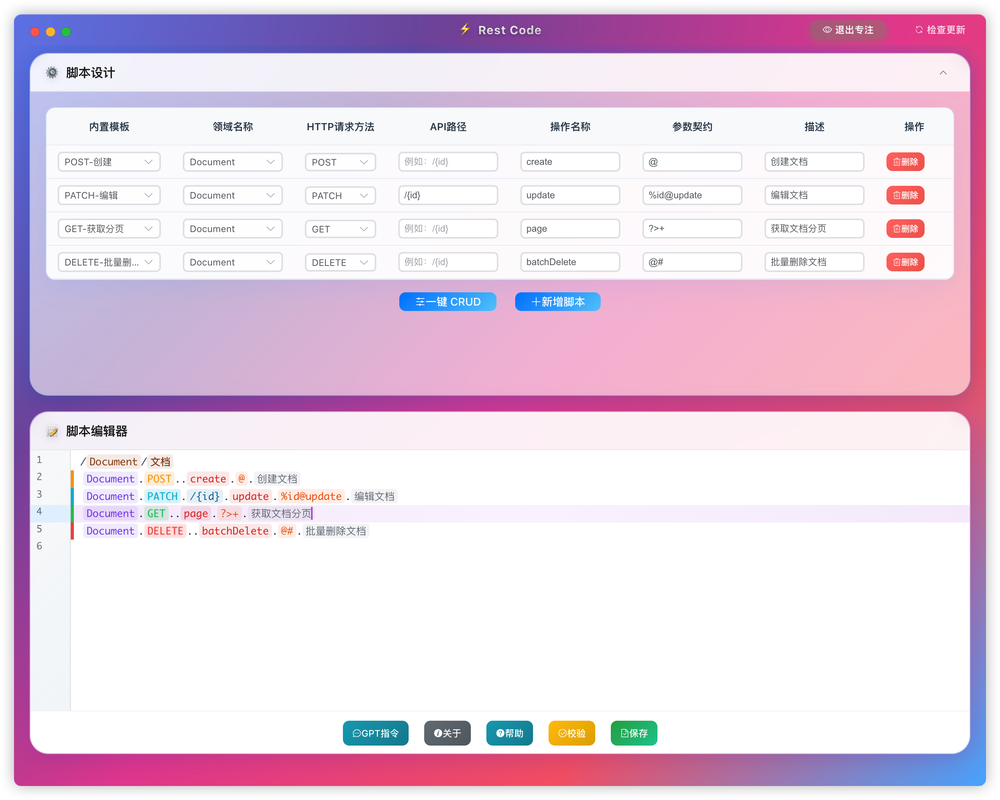

# Rest Code



## 背景

随着业务项目的数量及复杂度的提升，开发人员在项目中往往需要编写大量重复的 REST API 代码，例如请求参数解析、响应报文封装、路径和方法定义等。这样的重复性工作不仅耗时，还容易导致错误。在这样的背景下，`Rest Code` 应运而生。该工具的设计初衷是通过可视化界面简化 API 开发流程，让开发者专注于业务逻辑，而不再被重复的代码书写所困扰。通过可视化编辑、脚本文件及内置模板的组合，`Rest Code` 可以帮助开发人员快速生成符合企业规范的 API 代码，显著提升开发效率，减少手工错误，确保代码的统一性和可维护性。

## 概述

`Rest Code` 是一个设计完全遵从 `研发组前后端开发规范` ，采用 `Electron`、`Vite` 和 `Vue 3` 开发的桌面应用程序，旨在帮助开发人员自动生成 REST API 后端代码。它提供了直观的界面，用户可以通过可视化编辑和参数配置，生成 `.ras` 脚本（`Rest API Script`），并自动生成符合 `Spring Boot` 标准的代码。

通过灵活的 `.ras` 脚本语言，开发者可以快速定义 API 结构，同时内置的业务模板覆盖常见场景，减少了重复工作。模板还可以根据项目需求持续优化，帮助团队提高开发效率和代码一致性。

## 产品特性

- **可视化编辑**：提供直观的图形界面，方便用户进行领域和 API 脚本的编辑。
- **脚本导出与加载**：支持保存为 `.ras` 脚本，以及 从 `.ras` 脚本加载。
- **拖放加载**：支持拖放`.ras` 脚本加载，同时支持点击打开文件对话框打开文件来加载。
- **内置模板**：内置了常用的 API 操作模板，如创建、编辑、删除、查询等，帮助用户快速生成脚本。
- **自动代码生成**：根据编写的 `.ras` 脚本，自动生成符合 `Spring Boot` 标准的后端代码，包括控制器、服务、实体类等。
- **可扩展性**：支持用户自定义模板和配置，以满足不同项目的特殊需求。
- **校验功能**：提供脚本校验功能，实时检测脚本中的错误和重复，保证生成代码的质量。
- **一键 CRUD**（inspire by [@linjiahui](http://gitea126.weightyware.com:16680/linjiahui)）：快速生成常用的 CRUD 脚本，提升开发效率。
- **代码预览**（inspire by [@fengzilong](http://gitea126.weightyware.com:16680/fengzilong)）：在生成代码之前，支持预览生成的代码，方便用户检查和修改。

## Ras 文件格式

Ras 文件是一种专门为`Rest Code`设计的脚本文件，用于描述 REST API 的领域模型和操作。它通过简洁的语法规则，定义了领域声明和 API 操作，进而帮助生成符合业务逻辑的 API 控制器代码。

Ras 文件分为两部分：**Domain 声明** 和 **API 脚本**。

1. **Domain 声明**：文件的头部由若干行 `Domain声明` 组成，每个声明由 `/` 分割，用于定义领域名称和领域描述。`Domain 声明` 与内置模板结合使用，以辅助用户快速输入 `API 脚本`。

2. **API 脚本**：文件的主体由若干行 `API 脚本` 组成，每个脚本元素通过 `.` 分割，用于描述 API 操作，包括请求方法、路径、参数和描述等。每个 `API 脚本` 将生成对应的 `Spring Boot Rest Controller` 代码。

### Domain 声明格式

**格式**：`领域名称/领域描述`

- 领域名称是 API 所属的业务模块名称，如 `User`。
- 领域描述则是对该模块的简单说明，如 `用户。

**示例**：

```text
User/用户
Order/订单
```

### API 脚本格式

**格式**：`领域名称.HTTP请求方法.API路径（可为空）.操作名称（方法名称）.参数契约（可为空）.描述`

- 领域名称：与 Domain 声明中的领域名称一致。
- HTTP 请求方法：如 `GET`、`POST`、`PUT`、`DELETE` 等。
- API 路径：可以为空，若不为空，则指定 API 的路径。
- 操作名称：即生成的控制器中对应方法的名称。
- 参数契约：定义请求体、查询参数和路径参数的格式，支持多种参数类型。
- 描述：对 API 操作的简要说明。

**示例**：

```text
User.POST..create.@.新增用户
Order.GET./{id}.get.#id.获取订单详情
```

### 参数契约格式

`参数契约` 是 `API 脚本` 中用于描述请求和响应参数的部分。契约的格式为：`@xxx?yyy#num$str>zzz`，其中 `@、?、#、$、>` 是特殊的前缀符，分别表示不同类型的请求和响应参数。

1. `@`：表示 `@RequestBody` 请求参数，通常用于 JSON 请求体。  
   - `@` 表示单个对象，例如：`@RequestBody @Valid UserReqVo reqVo`。
   - `@=` 表示对象列表，例如：`@RequestBody @Valid List<UserReqVo> reqVos`。

2. `?`：表示 `Query` 查询参数，通常用于 `GET` 请求的查询条件。  
   - 示例：`UserQueryVo queryVo`。

3. `#`：表示 `@PathVariable` 数值型路径参数。  
   - 示例：`@PathVariable("id") long id`。

4. `$`：表示 `@PathVariable` 字符串型路径参数。  
   - 示例：`@PathVariable("orgCode") String orgCode`。

5. `>`：表示 `@ResponseBody` 响应报文。  
   - `>` 表示返回单个对象，例如：`@ResponseBody Result<UserRespVo>`。
   - `>=` 表示返回对象列表，例如：`@ResponseBody Result<List<UserRespVo>>`。
   - `><` 表示返回树形结构，例如：`@ResponseBody Result<TreeNode<Long, UserTreeVo>>`。
   - `>+` 表示返回分页对象，例如：`@ResponseBody Result<Page<UserRespVo>>`。
   - 不存在 `>` 前缀符时，表示返回空对象，例如：`@ResponseBody Result<Void>`。

所有这些片段都是可选的，可以根据实际需求选择 0 个或多个，并且顺序也没有严格要求。各片段中的 `xxx、yyy、num、str、zzz` 代表具体的业务含义，需要遵循驼峰命名法，确保清晰易读。

## 操作指南

### 界面介绍

- **文件加载**：用于打开已有的 `.ras` 脚本文件。
- **生成代码**：配置生成代码的相关参数，如输出路径、包名等。
- **领域编辑**：编辑领域名称和描述，领域是业务模块的划分。
- **脚本编辑**：编辑 API 脚本，包括操作名称、请求方法、参数契约等。
- **脚本查看**：实时查看生成的 `.ras` 脚本内容。
- **帮助**：查看帮助文档，了解工具的使用方法和脚本格式。

### 基本操作

1. **添加领域**：
   - 在领域编辑区域，点击`新增领域`按钮。
   - 输入领域名称和描述。

2. **添加脚本**：
   - 在脚本编辑区域，点击`新增脚本`按钮。
   - 选择领域名称和内置模板，模板会自动填充脚本内容。
   - 根据需要修改脚本的各个部分。

3. **一键 CRUD**：
   - 在脚本编辑区域，点击`一键 CRUD`按钮。
   - 选择需要生成 CRUD 脚本的领域，自动添加常用的增删改查脚本。

4. **校验脚本**：
   - 在脚本查看区域，点击`校验`按钮。
   - 检查脚本的格式和内容，提示可能的错误和重复。

5. **保存脚本**：
   - 在脚本查看区域，点击“保存”按钮。
   - 将编辑好的 `.ras` 脚本保存到文件。

6. **生成代码**：
   - 在生成代码区域，配置框架基本包名、源码输出路径、源码基本包名等参数。
   - 点击“生成代码”按钮，生成后端代码。

7. **预览代码**：
   - 在生成代码区域，点击“预览”按钮。
   - 查看生成的代码内容，检查是否符合预期。

### 脚本编写注意事项

- **领域名称**：应为大写字母开头的驼峰命名，如 `User`。
- **操作名称**：应为小写字母开头的驼峰命名，如 `createUser`。
- **参数契约**：根据 API 的需求，正确使用 `@、?、#、$、>` 等前缀符。
- **避免重复**：同一领域下，操作名称和参数契约的组合不能重复。

## 代码生成流程图


### 步骤说明：

1. **开始**：用户启动应用程序，进入主界面。

2. **用户打开应用程序**：应用程序启动后，用户可以选择下一步操作。

3. **是否加载现有脚本？**：用户决定是加载已有的 `.ras` 脚本文件还是创建新的脚本。

   - **是**：用户选择并加载一个已有的 `.ras` 脚本文件。
   - **否**：用户在应用程序中创建一个新的脚本。

4. **编辑领域和脚本**：用户通过界面添加或修改领域和 API 脚本。

   - **领域编辑**：定义领域名称和描述，划分业务模块。
   - **脚本编辑**：为每个领域添加 API 脚本，设置请求方法、路径、操作名称、参数契约和描述等。

5. **配置代码生成参数**：在“生成代码”区域，用户配置以下参数：

   - **框架基本包名**：如 `com.example.framework`。
   - **源码输出路径**：如 `D:/workspace/project/src/main/java`。
   - **源码基本包名**：如 `com.example.project.module`。
   - **生成方式**：选择“覆盖”或“增量”模式。

6. **校验脚本**：用户点击“校验”按钮，应用程序会检查脚本的格式和内容。

   - 检查领域和脚本的命名规范。
   - 检查参数契约的正确性。
   - 检查是否有重复的操作。

7. **校验通过？**

   - **否**：如果校验失败，应用程序会显示错误信息，用户需要返回编辑领域和脚本，修正错误。
   - **是**：如果校验通过，进入下一步。

8. **解析 .ras 脚本**：应用程序解析 `.ras` 脚本文件，提取领域、API 方法和参数等信息。

9. **生成 Java 代码**：根据解析的信息和预定义的模板，生成对应的 Java 源代码文件，包括：

   - **Controller**：控制器类，处理 HTTP 请求。
   - **Service**：服务接口和实现类，封装业务逻辑。
   - **VO 类**：请求和响应的对象模型。
   - **Converter**：对象转换器，转换实体与 VO 之间的数据。

10. **预览或保存生成的文件**：用户可以选择预览生成的代码，或者直接保存到指定的输出路径。

    - **预览**：在应用程序中查看生成的代码内容。
    - **保存**：将生成的代码文件写入到指定的目录中。

11. **结束**：代码生成过程完成，用户可以在项目中使用生成的代码。
