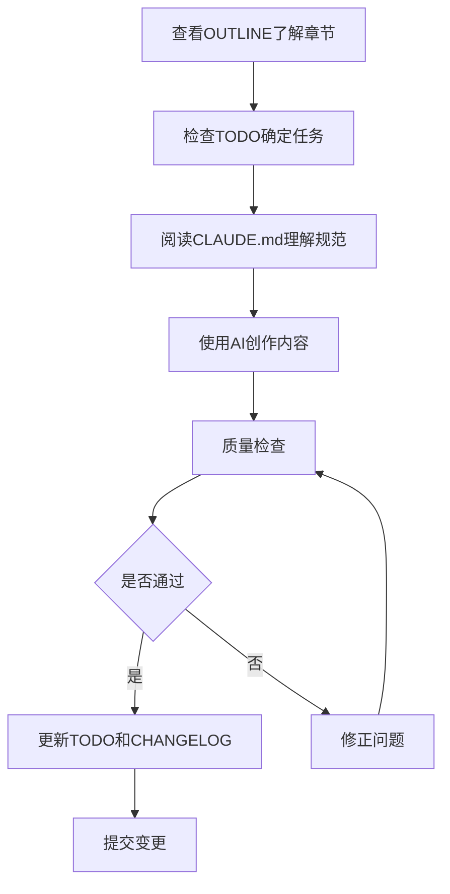

# 开始使用 - AI辅助开发实战指南

> 如何高效使用本项目和Claude Code完成内容创作

## 项目介绍

这是一个使用**模块化文档结构**和**最佳实践**组织的知识分享项目。本指南将帮助你理解项目结构、工作流程，以及如何与AI高效协作。

## 快速开始

### 1. 了解项目结构

```
ai-development-guide/
├── README.md              # 📖 从这里开始
├── OUTLINE.md             # 📋 详细提纲（8个章节）
├── TODO.md                # ✅ 待办事项追踪
├── CHANGELOG.md           # 📝 变更历史记录
├── CLAUDE.md              # 🤖 AI协作配置
├── GETTING_STARTED.md     # 🚀 本文件
├── chapters/              # 📚 章节详细内容
├── assets/                # 🖼️ 图片等资源
├── references/            # 🔗 参考资料
└── templates/             # 📄 可复用模板
```

### 2. 核心文档说明

| 文档 | 作用 | 何时查看 |
|------|------|----------|
| `README.md` | 项目总览 | 第一次了解项目 |
| `OUTLINE.md` | 详细提纲 | 规划内容、查看结构 |
| `TODO.md` | 任务清单 | 检查进度、确定下一步 |
| `CHANGELOG.md` | 变更日志 | 记录重要变更 |
| `CLAUDE.md` | AI配置 | 让AI理解项目规范 |
| `GETTING_STARTED.md` | 使用指南 | 学习工作流程 |

### 3. 工作流程

#### 标准创作流程



#### 实际操作步骤

**步骤1: 规划任务**
```bash
# 查看当前待办事项
cat TODO.md

# 查看详细提纲了解上下文
cat OUTLINE.md
```

**步骤2: 与AI协作创作**

使用Claude Code时，AI会自动读取 `CLAUDE.md` 配置文件，理解项目规范。

示例提示词：
```
请帮我创作第一章"理解LLM的本质与边界"的内容，
基于OUTLINE.md中的提纲。确保符合CLAUDE.md中的所有规范。
```

**步骤3: 质量检查**

运行质量检查清单（见CLAUDE.md）：
- [ ] 内容准确性
- [ ] Markdown格式
- [ ] 代码可运行
- [ ] 链接有效

**步骤4: 更新记录**

```bash
# 更新TODO.md
# 将 [ ] 改为 [x] 标记完成

# 更新CHANGELOG.md
# 添加新的变更记录
```

## 使用Claude Code的最佳实践

### 1. 利用项目配置

Claude Code会自动识别 `CLAUDE.md` 文件，你无需每次都重复说明项目规范。

**示例对话**：
```
你: 创建第二章的内容
AI: (自动参考CLAUDE.md中的规范进行创作)
```

### 2. 分步骤执行

不要一次性要求完成过多任务，分步骤进行：

❌ **不好的示例**:
```
请完成所有8个章节的内容创作
```

✅ **好的示例**:
```
第一步：请创建第一章的1.1节"Token概念"
第二步：创建1.2节"Prompt概念"
...
```

### 3. 使用TODO管理

让AI帮你管理TODO列表：

```
请查看TODO.md，选择一个高优先级任务开始执行，
完成后更新TODO状态。
```

### 4. 保持上下文清晰

定期提醒AI项目的关键信息：

```
我们正在创作AI辅助开发实战指南，当前任务是第三章Cursor使用指南。
请确保内容符合CLAUDE.md中定义的写作风格。
```

## 常见任务示例

### 任务1: 创建新章节

```
任务：创建第一章"理解LLM的本质与边界"

步骤：
1. 基于OUTLINE.md第一章的提纲
2. 创建 chapters/01-llm-fundamentals.md
3. 包含所有小节内容
4. 提供代码示例和图表
5. 符合CLAUDE.md的写作规范
6. 完成后更新TODO.md
```

### 任务2: 添加代码示例

```
请在第一章中添加Token计算的代码示例。

要求：
- 使用JavaScript或Python
- 包含详细注释
- 提供运行说明
- 附带解释文字
```

### 任务3: 优化现有内容

```
请审查 chapters/03-cursor-guide.md：

检查项：
1. Markdown格式是否规范
2. 链接是否有效
3. 代码示例是否完整
4. 中英文空格是否正确
5. 内容逻辑是否连贯

发现问题请直接修正。
```

### 任务4: 更新文档

```
我完成了第一章的创作，请帮我：

1. 在TODO.md中标记第一章相关任务为完成
2. 在CHANGELOG.md中添加变更记录
3. 检查是否需要更新README.md
```

## 质量保证

### 内容验证清单

每个章节完成后，使用此清单验证：

**技术准确性**
- [ ] 所有技术概念准确无误
- [ ] 代码示例可以运行
- [ ] 命令和配置正确有效
- [ ] 工具版本信息最新

**格式规范**
- [ ] Markdown语法正确
- [ ] 代码块指定语言
- [ ] 中英文空格正确
- [ ] 标题层级合理
- [ ] 列表缩进统一

**内容完整**
- [ ] 覆盖提纲所有要点
- [ ] 提供充足示例
- [ ] 关键概念有解释
- [ ] 包含必要的图表

**可读性**
- [ ] 逻辑清晰连贯
- [ ] 段落长度适中
- [ ] 使用小标题分段
- [ ] 重点内容突出

### 常见问题修正

**问题1: Markdown格式错误**
```markdown
# 错误：代码块未指定语言
```
const x = 1;
```

# 正确：指定语言
```javascript
const x = 1;
```
```

**问题2: 中英文空格缺失**
```markdown
# 错误
这是Token的概念

# 正确
这是 Token 的概念
```

**问题3: 链接失效**
```markdown
# 使用相对路径
[查看提纲](./OUTLINE.md)  ✅

# 避免绝对路径
[查看提纲](/ai-development-guide/OUTLINE.md)  ❌
```

## 进度追踪

### 使用TODO.md

TODO.md 使用三种状态标记：

```markdown
- [ ] 待完成
- [~] 进行中
- [x] 已完成
```

### 使用CHANGELOG.md

遵循语义化版本号：

```markdown
## [0.2.0] - 2025-11-18

### 新增
- 完成第一章LLM基础概念

### 变更
- 优化README结构

### 修复
- 修正OUTLINE中的错别字
```

版本规则：
- 主版本号(1.0.0): 重大更新或重组
- 次版本号(0.1.0): 完成主要章节
- 修订号(0.0.1): 小修订和修复

## 模板使用

### .cursorrules 模板

位置: `templates/cursorrules-template.md`

**使用场景**: 配置Cursor项目时参考

**如何使用**:
1. 复制模板内容
2. 根据项目调整
3. 保存为项目根目录的 `.cursorrules` 文件

### CLAUDE.md 模板

位置: `templates/CLAUDE-template.md`

**使用场景**: 为新项目配置Claude Code

**如何使用**:
1. 复制模板内容
2. 填充项目特定信息
3. 保存为项目根目录的 `CLAUDE.md` 文件

## 协作技巧

### 与AI有效沟通

**DO ✅**
- 提供清晰的任务描述
- 引用项目中的文件和规范
- 分步骤执行复杂任务
- 及时反馈和纠正

**DON'T ❌**
- 不要假设AI记得之前的对话
- 不要一次要求太多任务
- 不要跳过质量检查
- 不要盲目接受所有输出

### 提示词技巧

**引用配置**:
```
请按照CLAUDE.md中的规范创作内容
```

**指定输出格式**:
```
请以Markdown格式输出，包含代码块和示例
```

**要求自检**:
```
完成后请运行CLAUDE.md中的质量检查清单
```

## 下一步行动

1. **第一次使用**:
   - 阅读 `README.md` 了解项目
   - 查看 `OUTLINE.md` 了解内容结构
   - 阅读本文件理解工作流程

2. **开始创作**:
   - 检查 `TODO.md` 找到高优先级任务
   - 阅读 `CLAUDE.md` 理解规范
   - 与AI协作开始创作

3. **持续改进**:
   - 定期更新 `TODO.md` 和 `CHANGELOG.md`
   - 收集优质参考资料到 `references/`
   - 优化 `CLAUDE.md` 配置

## 获取帮助

### 项目文档
- 查看 `CLAUDE.md` 了解详细规范
- 查看 `templates/` 获取模板参考
- 查看 `references/resources.md` 获取外部资源

### 与AI对话
```
我在使用这个项目时遇到了问题：[描述问题]
请参考GETTING_STARTED.md提供帮助。
```

## 总结

这个项目结构的设计遵循以下原则：

1. **模块化**: 每个文档有明确职责
2. **可追踪**: TODO和CHANGELOG记录进度
3. **可配置**: CLAUDE.md指导AI行为
4. **可复用**: templates提供模板参考
5. **可维护**: 清晰的结构易于长期维护

**记住**: 好的组织结构 + AI工具 + 人工把关 = 高质量输出

---

**最后更新**: 2025-11-17
**维护者**: dhslegen

祝你创作顺利！🚀
