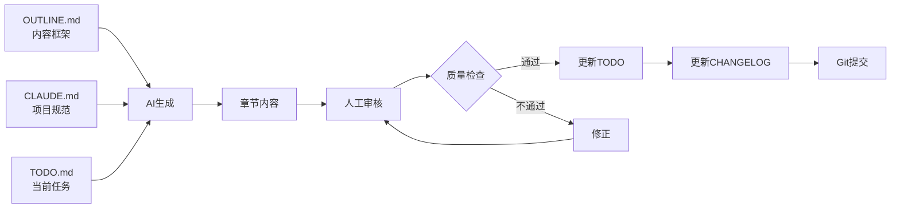

# 项目概览 - AI辅助开发实战指南

## 项目目标

将你脑海中关于AI辅助开发的"碎碎念"，转化为一个**结构清晰、内容专业、易于维护**的知识分享项目。

## 项目特色

### 1. 模块化组织 📦

```
清晰的职责分离
├── 核心文档层：README, OUTLINE, TODO, CHANGELOG
├── 配置层：CLAUDE.md, .claude/
├── 内容层：chapters/
├── 资源层：assets/, references/
└── 模板层：templates/
```

**优势**:
- 易于定位和修改
- 便于扩展和重组
- 降低维护成本

### 2. 最佳实践驱动 ⭐

遵循Claude Code推荐的项目组织方式：
- ✅ `CLAUDE.md` - 项目配置和规范
- ✅ `TODO.md` - 任务追踪
- ✅ `CHANGELOG.md` - 变更日志
- ✅ 模板化的可复用资源

### 3. AI友好设计 🤖

**上下文管理**:
- CLAUDE.md 提供项目全景
- OUTLINE.md 提供内容框架
- TODO.md 提供任务清单

**防失忆机制**:
- 每个文件都有清晰的文档头部
- 关键信息多处复现
- 使用引用链接保持连贯性

### 4. 人机协作优化 🤝

```
人的职责              AI的职责
├── 战略规划    ←→   执行细节
├── 质量把关    ←→   内容生成
├── 经验提供    ←→   结构组织
└── 最终审核    ←→   格式规范
```

## 文档体系架构

### 第一层：导航层

| 文档 | 作用 | 读者 |
|------|------|------|
| README.md | 项目入口，快速了解 | 所有人 |
| GETTING_STARTED.md | 使用指南，工作流程 | 创作者 |
| PROJECT_OVERVIEW.md | 架构说明，设计理念 | 维护者 |

### 第二层：规划层

| 文档 | 作用 | 更新频率 |
|------|------|---------|
| OUTLINE.md | 内容提纲 | 低（初期定型） |
| TODO.md | 任务清单 | 高（每日更新） |
| CHANGELOG.md | 变更日志 | 中（有变更时） |

### 第三层：配置层

| 文档 | 作用 | 服务对象 |
|------|------|---------|
| CLAUDE.md | AI协作配置 | Claude Code |
| .cursorrules | Cursor配置（模板） | Cursor |

### 第四层：内容层

```
chapters/
├── 01-llm-fundamentals.md      # 理论基础
├── 02-ai-coding-tools.md       # 工具对比
├── 03-cursor-guide.md          # Cursor实战
├── 04-claude-code-guide.md     # Claude Code实战
├── 05-my-journey.md            # 个人历程
├── 06-case-studies.md          # 案例分析
└── 07-best-practices.md        # 最佳实践
```

### 第五层：支撑层

```
assets/          # 静态资源
├── screenshots/ # 截图
├── diagrams/    # 图表
└── icons/       # 图标

references/      # 参考资料
└── resources.md # 链接汇总

templates/       # 可复用模板
├── cursorrules-template.md
├── CLAUDE-template.md
└── mcp-config-example.json
```

## 工作流设计

### 标准创作流程

```
1. 规划阶段
   └── 查看 OUTLINE.md + TODO.md

2. 创作阶段
   └── AI读取 CLAUDE.md → 生成内容 → 人工审核

3. 质量阶段
   └── 运行检查清单 → 修正问题

4. 记录阶段
   └── 更新 TODO.md + CHANGELOG.md

5. 版本阶段
   └── Git提交 → 版本标记
```

### 信息流动



## 防失忆策略

### 问题：AI的上下文窗口限制

**解决方案**:

1. **配置文件持久化**
   - CLAUDE.md 包含所有关键规范
   - 每次对话AI都会读取

2. **任务原子化**
   - TODO.md 将大任务拆分为小任务
   - 每个任务独立完整

3. **引用机制**
   - 提示词中明确引用文档
   - "请参考OUTLINE.md第三章"

4. **多文档复现**
   - 关键信息在多处出现
   - 降低遗漏风险

### 实践示例

❌ **容易失忆的方式**:
```
AI: 请帮我写第三章
(AI可能忘记项目规范、写作风格等)
```

✅ **防失忆的方式**:
```
AI: 请参考OUTLINE.md创建第三章"Cursor使用完全指南"，
    确保符合CLAUDE.md中定义的Markdown规范和写作风格。
    完成后更新TODO.md。
```

## 可维护性设计

### 1. 单一职责原则

每个文档有明确唯一的职责：
- README → 项目介绍
- OUTLINE → 内容框架
- TODO → 任务追踪
- CHANGELOG → 历史记录

### 2. 变更隔离

修改一处不影响其他：
- 章节内容独立文件
- 模板与实例分离
- 配置与内容分离

### 3. 版本控制

```
语义化版本号：X.Y.Z

X (主版本): 重大重组或发布
Y (次版本): 完成主要章节
Z (修订号): 小修订和修复
```

### 4. 文档即代码

- 使用Git管理
- Markdown格式
- 代码审查机制
- 持续改进

## 扩展性设计

### 添加新章节

```bash
# 1. 在chapters/创建文件
touch chapters/08-new-chapter.md

# 2. 更新OUTLINE.md

# 3. 在TODO.md添加任务

# 4. 在CHANGELOG.md记录
```

### 添加新模板

```bash
# 在templates/添加
cp new-template.md templates/

# 在references/resources.md引用
```

### 添加新功能

示例：添加视频教程

```bash
# 1. 创建目录
mkdir -p assets/videos

# 2. 更新项目结构说明
# 在 CLAUDE.md 和 PROJECT_OVERVIEW.md

# 3. 添加引用说明
# 在 GETTING_STARTED.md
```

## 质量保证机制

### 三层检查

1. **AI自检** (自动化)
   - CLAUDE.md中定义检查清单
   - AI按清单自检

2. **人工审核** (把关)
   - 技术准确性验证
   - 真实性检查
   - 可读性评估

3. **版本追踪** (历史)
   - Git记录所有变更
   - CHANGELOG记录重要变更
   - 便于回溯和改进

### 质量标准

**内容质量**:
- ✅ 技术准确
- ✅ 逻辑清晰
- ✅ 示例可运行
- ✅ 真实不夸大

**格式质量**:
- ✅ Markdown规范
- ✅ 中英文空格
- ✅ 代码高亮
- ✅ 链接有效

**项目质量**:
- ✅ 结构清晰
- ✅ 文档完整
- ✅ 易于导航
- ✅ 便于维护

## 成本优化

### 减少Token消耗

1. **精简配置**
   - CLAUDE.md包含必要信息
   - 避免冗余描述

2. **任务分解**
   - 小任务减少单次上下文
   - 分批完成降低重试成本

3. **模板复用**
   - templates/提供标准模板
   - 减少重复描述

### 提升效率

1. **清晰指令**
   - 减少误解和返工
   - 一次到位

2. **质量前置**
   - CLAUDE.md预设规范
   - 减少后期修正

3. **批量操作**
   - 一次性处理相似任务
   - 提高吞吐量

## 协作模式

### 人机职责分工

**人的优势**:
- 战略规划
- 创意构思
- 质量把关
- 真实性保证

**AI的优势**:
- 内容生成
- 格式规范
- 结构组织
- 重复工作

### 最佳协作实践

```
理想模式：
1. 人→ 提供框架和要点
2. AI→ 展开详细内容
3. 人→ 审核修正
4. AI→ 格式优化
5. 人→ 最终确认
```

## 项目演进路线

### Phase 1: 框架搭建 ✅ (已完成)
- [x] 目录结构
- [x] 核心文档
- [x] 配置文件
- [x] 模板准备

### Phase 2: 基础内容 (进行中)
- [ ] 第1-4章（理论和工具）
- [ ] 建立内容规范
- [ ] 积累优质示例

### Phase 3: 实战内容
- [ ] 第5-7章（经历和案例）
- [ ] 补充截图和图表
- [ ] 优化可读性

### Phase 4: 完善优化
- [ ] 全文校对
- [ ] 补充延伸阅读
- [ ] 准备分享材料
- [ ] 发布 v1.0

## 技术债务管理

### 已知待优化项

- [ ] 添加自动化格式检查脚本
- [ ] 创建章节模板自动生成工具
- [ ] 建立图表统一风格指南
- [ ] 添加多语言支持（可选）

### 保持技术债可控

- 定期review TODO.md
- 及时更新CHANGELOG.md
- 重构大于堆砌
- 质量优先于数量

## 总结

这个项目结构的核心优势：

1. **模块化** - 职责清晰，易于管理
2. **可追踪** - TODO和CHANGELOG记录一切
3. **AI友好** - 配置文件指导AI行为
4. **可复用** - 模板可用于其他项目
5. **可维护** - 结构清晰，文档完善
6. **可扩展** - 易于添加新内容
7. **高质量** - 多层质量保证机制

**这不仅是一个文档项目，更是一个AI辅助创作的最佳实践示范。**

---

**版本**: v0.1.0
**创建日期**: 2025-11-17
**维护者**: dhslegen
